# Installation & Preparations
## Installing Node.js

Para usar o discord.js, você precisará instalar o [`Node.js`]. discord.js v14 requer Node v16.11.0 ou superior.
:::tip
Discord.js relies on node.js because node.js serves as the "engine" that powers discord.js on your computer. It's as if discord.js were a car, and node.js were the engine propelling the car forward. Without node.js, discord.js cannot operate correctly because it lacks the necessary energy to make things happen on your computer. Therefore, node.js is a vital component for discord bots created with discord.js to run and interact with the discord platform.
:::

No matter your operating system, installing Node.js is as easy as making toast! Just follow the instructions below:

### Windows
On Windows, installation is as simple as pressing a button:

* **Visit the Node.js website:** First, go to the [official Node.js website](https://nodejs.org/) as if you were heading to a candy store.
* **Choose the version:** Select the latest version (LTS is recommended) as if you were picking your favorite ice cream flavor.
* **Download and Run the Installer:** Click the download button and open the downloaded file. The installer will guide you through the process, like a GPS to your destination.
* **Completion:** Once the installation is complete, you'll have Node.js installed on your Windows. It's like having a superpower at your fingertips!

### MacOS
On macOS, you have two options, choose the one you like best:

* **Traditional Method:** Go to the [`Node.js website`], choose the version you want, and follow the package installer instructions. It's as simple as making a cup of tea.
* **Hacker Mode:** If you're a fan of command-line tools, open the Terminal and type `brew install node`. It's like using a magic spell!

### Linux
For Linux enthusiasts, every distribution is like a different adventure:

* **Choose Your Distribution:** Visit the [`Node.js website`] for specific instructions for your Linux distribution. It's like following a unique treasure map!

## Downloading and setting up VSCode.

While it's not strictly essential, we recommend using `Visual Studio Code` (VSCode) for this documentation. VSCode is a highly recommended tool as it will make your experience of creating bots in discord.js easier and more efficient.

**Step 1: Open Your Web Browser**
* Open your web browser.
* Visit the official Visual Studio Code website at: [`https://code.visualstudio.com/`].

**Step 2: Choose Your Version**
* On the website, you will see options to download for Windows, macOS, or Linux, depending on your operating system. Click on the button that corresponds to your platform.

**Step 3: Start the Download**
* The download will start automatically after clicking the button.

When you open VSCode, you will encounter something like this:


Not very appealing, don't you think? But don't worry, we can make it better!

### Setting up project folder
:::tip
The name of this folder specifically will not affect the course of the project, so you can choose any name for this folder.
:::

Open your project folder or create a new folder where you want to work. You can do this by using the 'File' menu and selecting 'Open Folder' to open an existing project or create a new folder.

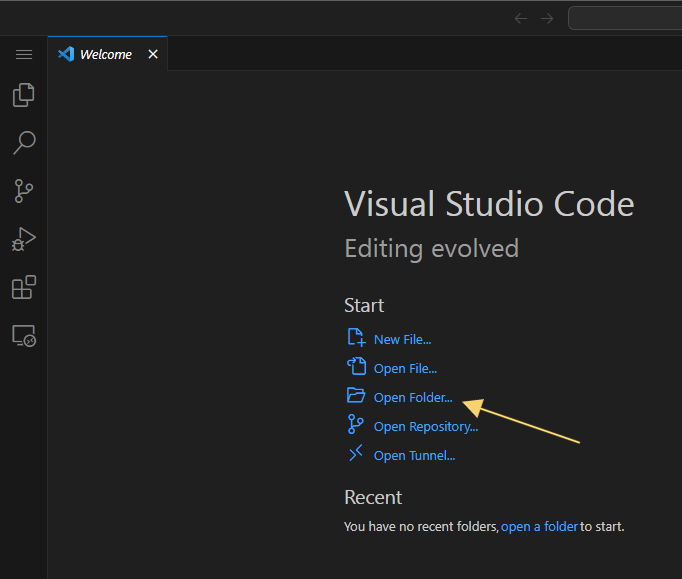

### Installing Extensions
:::warning
The action of downloading extensions is strictly optional and does not impact the flow of the documentation. It is done to customize and enhance the programming experience in VSCode but is not essential to follow the tutorial.
:::

Navigate to the left-hand corner and click on the grid icon in 'Extensions.'


### Theme

Now, it's time to select a theme to customize our VSCode environment. I personally love the [`Omni Owl Theme`] theme, but there are many other popular themes to explore, such as:

- [Dracula](https://marketplace.visualstudio.com/items?itemName=dracula-theme.theme-dracula)
- [Material Theme](https://marketplace.visualstudio.com/items?itemName=Equinusocio.vsc-material-theme)
- [Monokai Night Theme](https://marketplace.visualstudio.com/items?itemName=fabiospampinato.vscode-monokai-night)
- [One Dark Pro](https://marketplace.visualstudio.com/items?itemName=zhuangtongfa.Material-theme)

Feel free to browse this extensive collection of themes and choose the one that best suits your coding style.

Now, let's enter 'omni' into the search bar and then click on the 'Install' button.
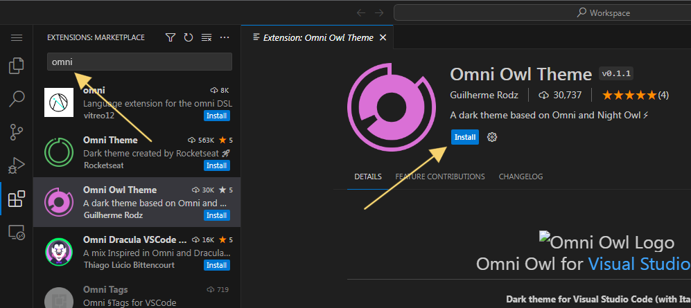

As we mentioned, quite charming, wouldn't you agree?
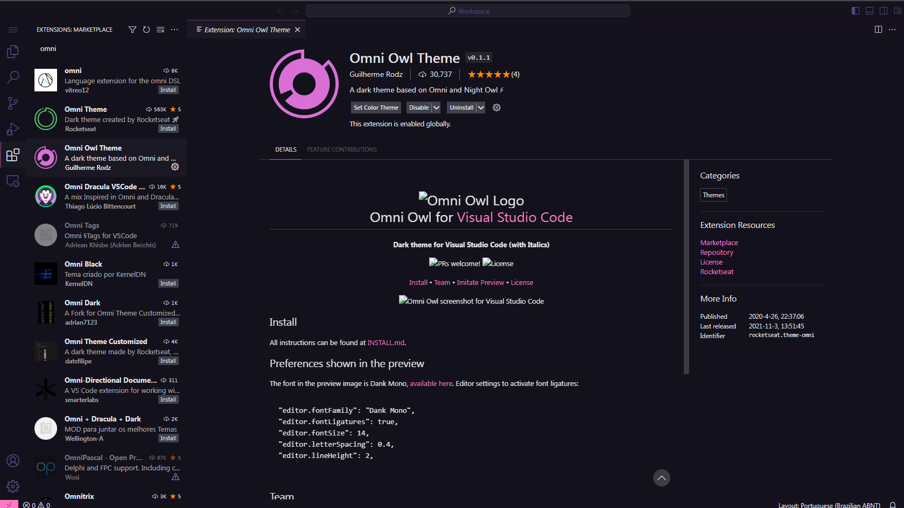

### Icons

Let's go through the same installation process as mentioned above to download a VSCode icon extension.

Now, it's time to select an icon theme to enhance our VSCode environment. While I personally recommend the [`Material Theme Icons`], you can explore similar options for your preference:

- [`Icons`](https://marketplace.visualstudio.com/items?itemName=tal7aouy.icons)
- [`File-icons`](https://marketplace.visualstudio.com/items?itemName=file-icons.file-icons)
- [`Set-icons`](https://marketplace.visualstudio.com/items?itemName=qinjia.seti-icons)

Feel free to browse and choose the icon theme that complements your coding experience!

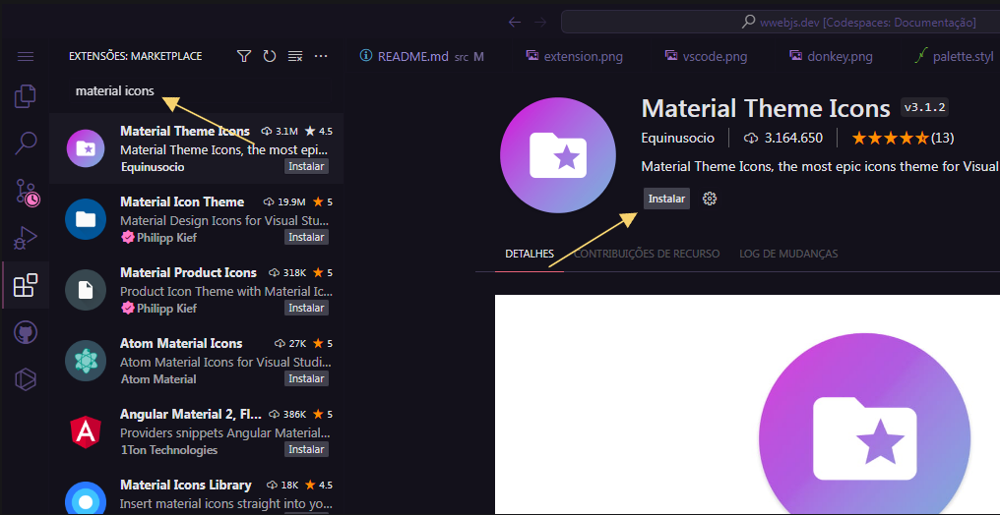

I highly recommend using the 'Material Theme Icons Ocean' to complement our 'Omni' theme.
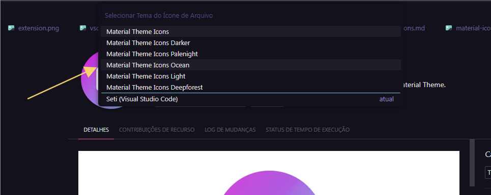

## Installing Discord.js

To install the discord.js module, we use the default package manager for node.js, [`npm`]. If you have followed the steps above correctly, there should be no issues with the module installation.

Now, let's open a terminal. To do that, click on the option located in the top left corner of your VSCode, represented by the first icon in the menu:

:::warning
You can also find this option in the header of VSCode, at the top, labeled as 'Terminal'.
:::

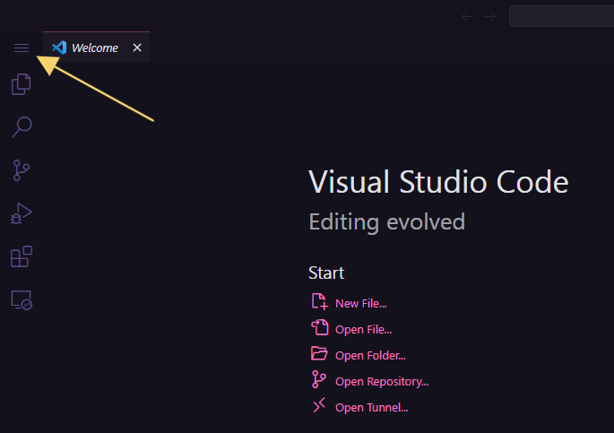

Now, simply go to `Terminal > New Terminal` or just press `Ctrl+Shift+'`.

Once the terminal is open, execute the command:
```bash
# press enter
npm i discord.js
```
Now, just wait for the module to install, and if everything goes well, it will return something like this:
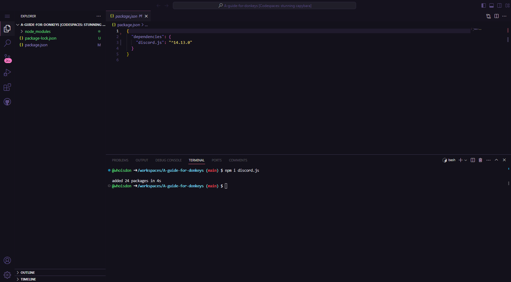

## Creating and configuring a bot

Now that you've installed Node and Discord.js, you're almost ready to start coding! The next step you need to take is to set up a real discord bot application through the discord website.

Creating one is straightforward. The steps you need to follow are as follows:

### Enabling the intents

1. Go to the [`Discord Developer Portal`] and log in to your account. Then, press the "New Application" button.

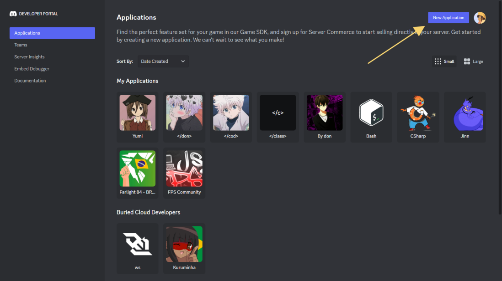

2. Now, give your bot a name and then click on the option to accept the terms of service. Afterward, press the "Create" button.

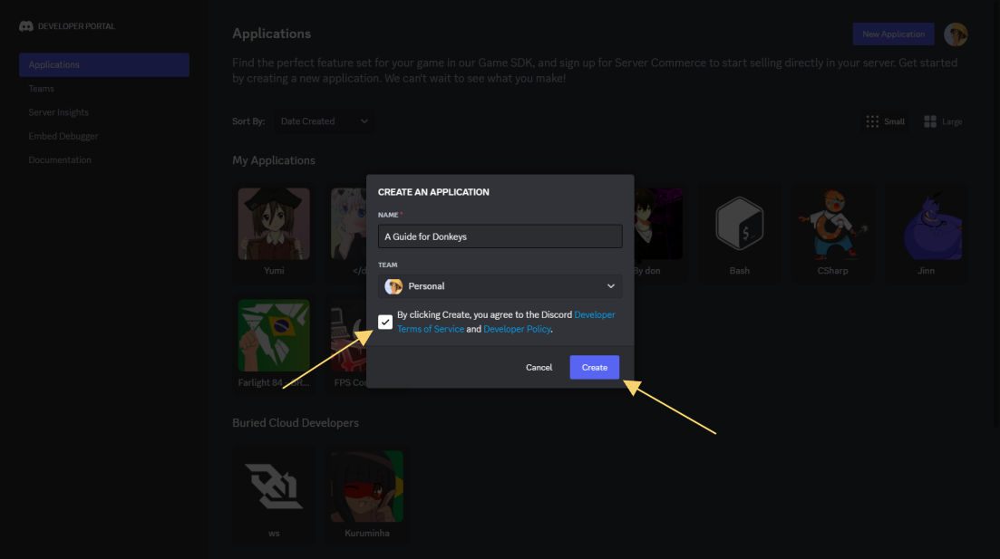

3. Next, navigate to the "Bot" tab, scroll down, enable all three options under "Privileged Gateway Intents," and then click "Save Changes".

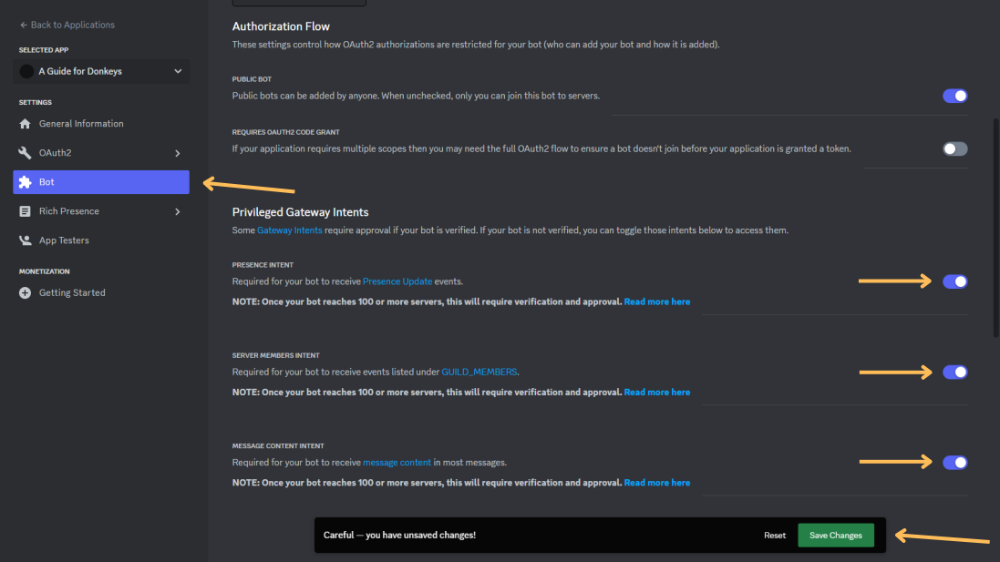

### Getting the token

:::danger
Why not share your Discord bot token with strangers, you ask? Well, it's like having a secret recipe for the world's best cookies – you wouldn't just give it to anyone, right? Your bot token is like the key to your bot's kingdom. Guard it like a treasure chest, because with great power comes great responsibility!
:::

1. Now, continuing in the "Bot" tab, let's click on the "Reset Token" option.

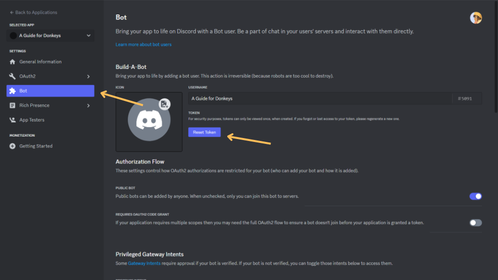

2. Next, click on "copy."

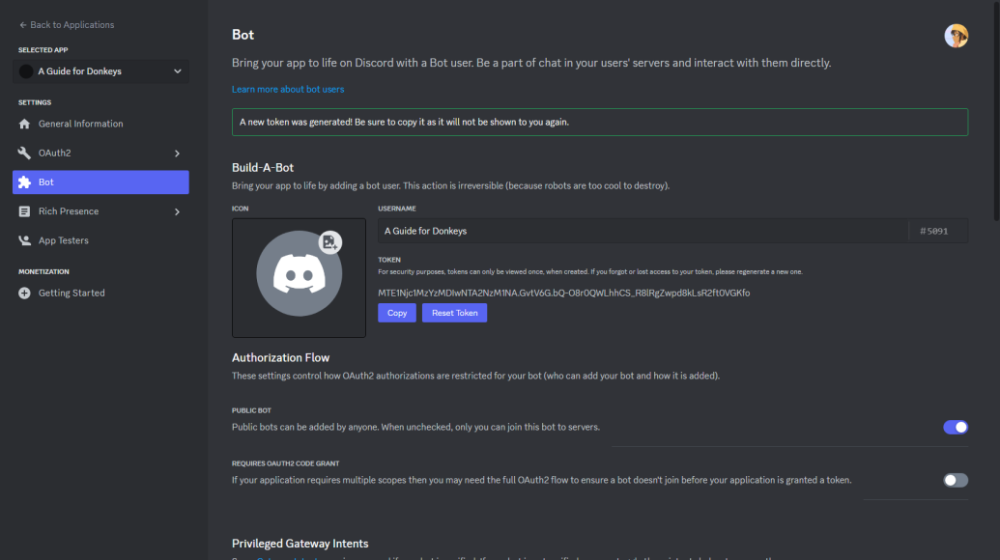
Keep this token in a safe place; we'll need it later!

### Adding bot to the server

1. In the "OAuth2" tab, under "URL Generator", let's add the scopes "bot" and "applications.commands".

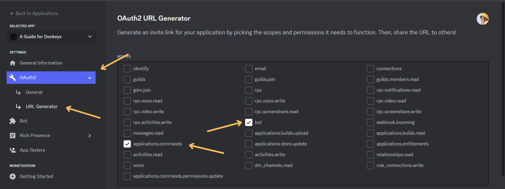

2. Scrolling down, let's select the "Administrator" option and then copy the generated URL under "Copy".

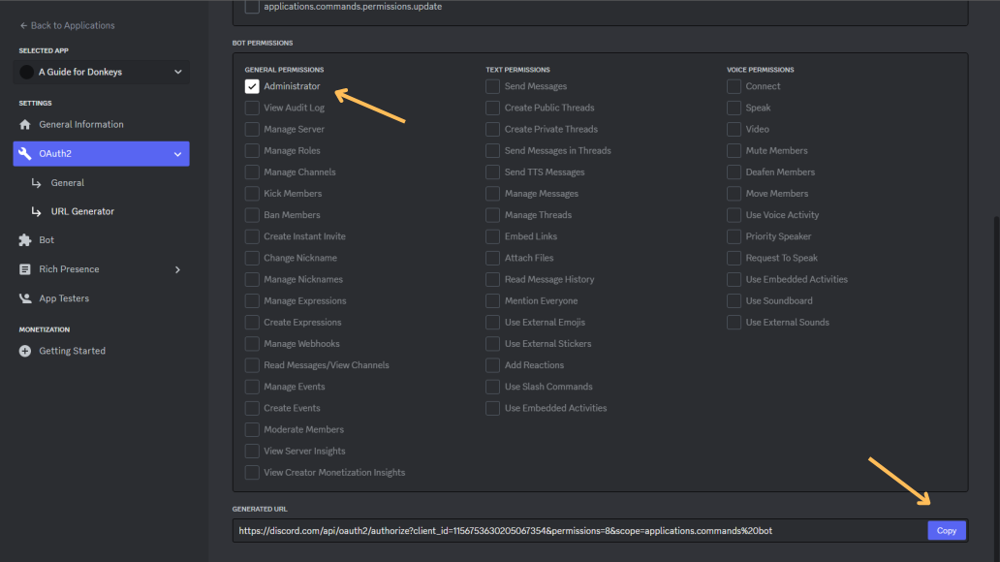

3. Now, in your web browser, paste this link and add the bot to our server.


<!-- Links -->

[`npm`]: https://www.npmjs.com/
[`Node.js`]: https://nodejs.org/
[`Node.js website`]: https://nodejs.org/
[`https://code.visualstudio.com/`]: https://code.visualstudio.com/

[`Omni Owl Theme`]: https://marketplace.visualstudio.com/items?itemName=guilhermerodz.omni-owl
[`Material Theme Icons`]: https://marketplace.visualstudio.com/items?itemName=Equinusocio.vsc-material-theme-icons

[`Discord Developer Portal`]: https://discord.com/developers/applications
