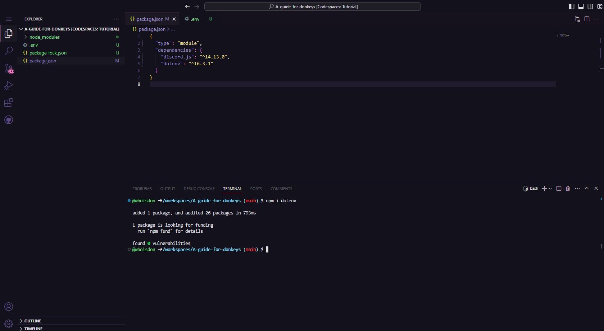

# Starting the application
## Configuration files

After adding your bot to a server, the next step is to kickstart development and get it online. We'll begin by creating a configuration file for your token and a main file for your bot application.

Open your VSCode; we're going to create some files and set up a few sections.

### Setting up environment variables

Environment variables are like special containers that hold important information your computer and programs need to work correctly. They can store things like settings, passwords, and other essential data, and programs can access these variables whenever they need that information. It's a way to keep sensitive or changing data separate from the code itself, making your applications more secure and flexible.

Inside your VSCode, at the root of your project, we're going to create a .env file, and within it, we'll place the following information:
```bash
TOKEN=your-token-goes-here
```
In this way:


Following the same installation process as the discord.js module, we will install the dotenv module, which is responsible for connecting us to the environment variables.

In the terminal, we'll execute the following command:
```bash
npm i dotenv
```

### Configuring the package.json

In node.js, the default module type is CommonJS, which is widely used. However, in this tutorial, we will be taking a different approach, aligning ourselves with the latest ECMAScript (ES) standards. We will be using the `type module`, a more recent and flexible feature for managing modules in node.js applications. This will allow us to take advantage of advanced module import and export capabilities, providing greater flexibility and readability to our code.



### Setting up the main file

Just like we created the `.env` file, we'll now create our main file, `index.js`.
