# Starting the application
## Configuration files

After adding your bot to a server, the next step is to kickstart development and get it online. We'll begin by creating a configuration file for your token and a main file for your bot application.

Open your VSCode; we're going to create some files and set up a few sections.

### Setting up `environment variables`

Environment variables are like special containers that hold important information your computer and programs need to work correctly. They can store things like settings, passwords, and other essential data, and programs can access these variables whenever they need that information. It's a way to keep sensitive or changing data separate from the code itself, making your applications more secure and flexible.

Inside your VSCode, at the root of your project, we're going to create a .env file, and within it, we'll place the following information:
```bash
TOKEN=your-token-goes-here
```
In this way:

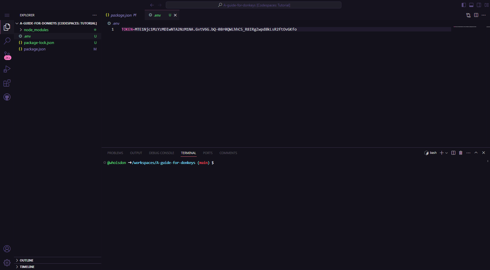

Following the same installation process as the discord.js module, we will install the dotenv module, which is responsible for connecting us to the environment variables.

In the terminal, we'll execute the following command:
```bash
npm i dotenv
```

### Setting up the `package.json`

In node.js, the default module type is CommonJS, which is widely used. However, in this tutorial, we will be taking a different approach, aligning ourselves with the latest ECMAScript (ES) standards. We will be using the `type module`, a more recent and flexible feature for managing modules in node.js applications. This will allow us to take advantage of advanced module import and export capabilities, providing greater flexibility and readability to our code.

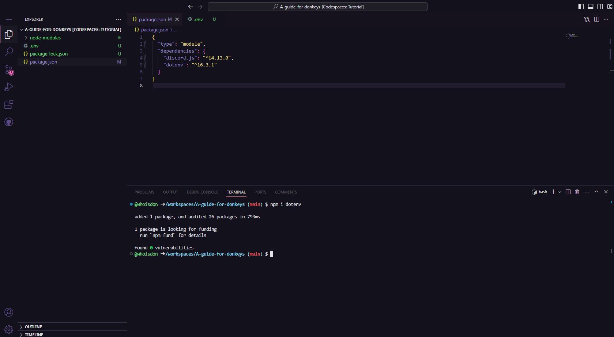

### Main file

Just like we created the `.env` file, we'll now create our main file, `index.js`. Inside this file, we will add the following content for a quick test:

```js
import { Client, GatewayIntentBits } from 'discord.js';
import 'dotenv/config';

const client = new Client({ intents: [GatewayIntentBits.Guilds] });

client.once('ready', () => {
	console.log(`Ready! Logged in as ${client.user.tag}`);
});

client.login(process.env.TOKEN);
```
Great, now let's check if our bot is working correctly:

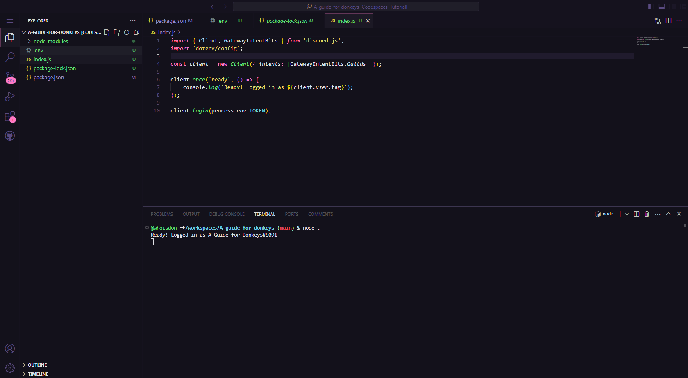

Excellent, in VSCode, it says it's online. Now, let's open Discord and go to the server where we added our application to verify if it's truly online.

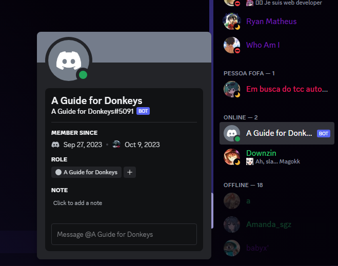

As we can see, it's indeed online. However, it doesn't have any useful functionality yet. Let's add and refine a few things to enhance its performance.

We're going to enhance our `index.js` for better performance and organization. We'll extend the `Client` class and add our methods. We'll add this to our main file:

```js
import Client from './src/Structure/Client.js';
import dotenv from 'dotenv/config';

import options from './src/Config/Options.js';
const client = new Client(options);

client.login(process.env.TOKEN);
```

Wow, that's a significant simplification, isn't it? However, if we start the application now, it will return some errors because we haven't created the `Client.js` or `Options.js` files yet. In the following steps, we will learn how to configure these and more files.

### Options

Within our project, we will create a folder called `src` (short for "source"). This folder will be used to organize all our code in a structured manner. Creating the folder is quite simple: just click on the icon located next to the project name and select `New Folder`. Like this:


Next, within our `src` folder, we will create a subfolder called `Config`. This folder will be used to store project configurations, including settings, options, and various important elements for the functioning of our application.

Inside our `Config` folder, we will create the `Options.js` file. This file will serve as a storage location for our `Intents` and potentially application `Partials`. Like this:

```js
import { GatewayIntentBits, Partials } from 'discord.js';

const options = {
  intents: [
    GatewayIntentBits.AutoModerationConfiguration,
    GatewayIntentBits.AutoModerationExecution,
    GatewayIntentBits.DirectMessageReactions,
    GatewayIntentBits.DirectMessages,
    GatewayIntentBits.GuildEmojisAndStickers,
    GatewayIntentBits.GuildIntegrations,
    GatewayIntentBits.GuildInvites,
    GatewayIntentBits.GuildMembers,
    GatewayIntentBits.GuildMessageReactions,
    GatewayIntentBits.GuildMessageTyping,
    GatewayIntentBits.GuildMessages,
    GatewayIntentBits.GuildModeration,
    GatewayIntentBits.GuildPresences,
    GatewayIntentBits.GuildScheduledEvents,
    GatewayIntentBits.GuildVoiceStates,
    GatewayIntentBits.GuildWebhooks,
    GatewayIntentBits.Guilds,
    GatewayIntentBits.MessageContent
  ],
  partials: [
    Partials.Channel,
    Partials.GuildMember,
    Partials.GuildScheduledEvent,
    Partials.Message,
    Partials.Reaction,
    Partials.ThreadMember,
    Partials.User
  ]
};

export default options;
```

These are all the Intents and Partials that your application can have; you are not obligated to use all of them. Feel free to modify them according to your application's specific needs. At the end, everything will look like this:

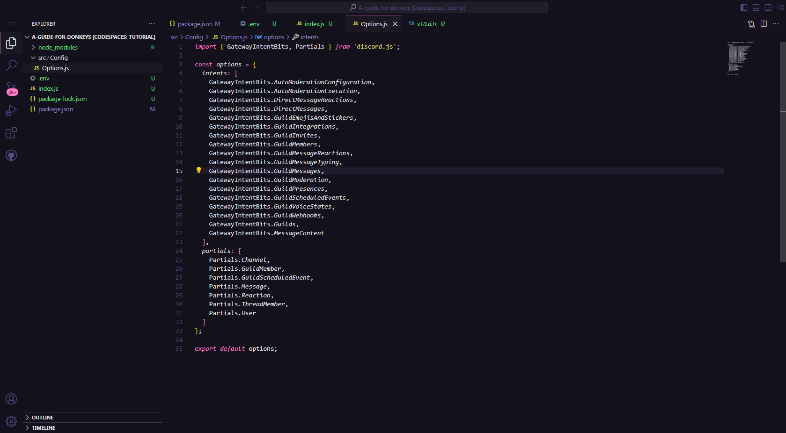

## Structures configuration

### Client

Continuing in the same vein as when we created the `Config` folder, we will now establish the `Structure` folder to accommodate our classes and methods. Within the `Structure` folder, we will add a file named `Client.js` with the following content:

```js
import { readdirSync } from 'fs';
import { join } from 'path';
import { Client } from 'discord.js';

export default class extends Client {
    constructor(options) {
        super(options);

        this.SlashCommandArray = [];
        this.getSlashCommands();
        this.getEvents();
  }

  async registerCommands() {
    await this.application.commands.set(this.SlashCommandArray)
  }

  async getEvents(path = 'src/Events') {
    const eventsFolders = readdirSync(path);
    for (const folders of eventsFolders) {
      const eventsFiles = readdirSync(`${path}/${folders}`);
      for (const files of eventsFiles) {
        if (!files.endsWith('.js')) return;
        const eventFile = join(process.cwd(), `${path}/${folders}/${files}`);
        const { default: EventMap } = await import('file://' + eventFile);
        const evnt = new EventMap(this);
        if (!evnt.once) {
           this.on(evnt.name, evnt.run);
        } else {
           this.once(evnt.name, evnt.run);
        }
      }
    }
  }
};
```
If configured correctly, everything will appear as follows:

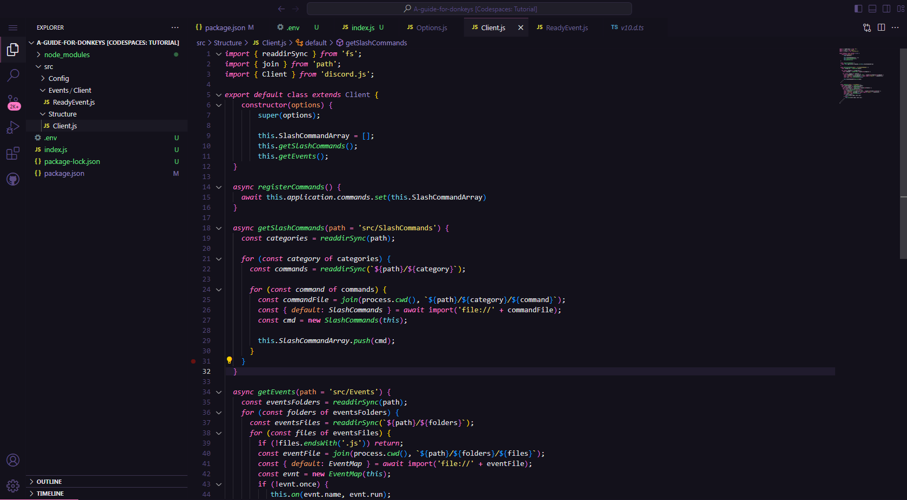

### EventMap

Following our extended `Client` class, we will create another class to handle our events, which will be named `EventMap`. Within our "Structure" folder, we will add the `EventMap.js` file and include the following content:

```js
class EventMap {
  constructor(client, options) {
    this.client = client;
    this.name = options.name;
    this.once = options.once || false;
  }
}

export default EventMap;
```
Like this:

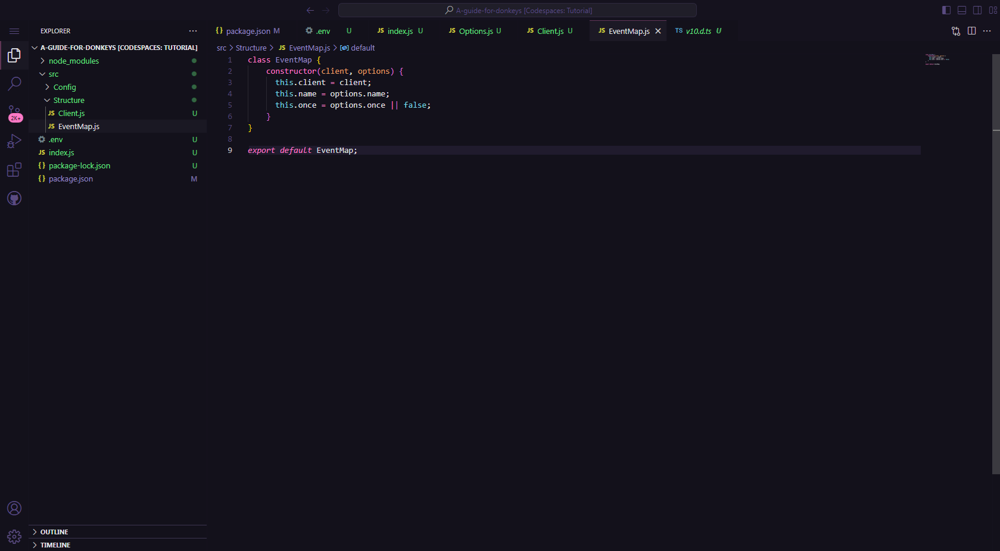

### SlashCommands

Following the approach we used for creating the `EventMap`, we will now create the `SlashCommands` class. In a similar manner, we will add a `SlashCommands.js` file within the `Structure` folder, with the following content:

```js
class SlashCommands {
  constructor(client, options) {
    this.client = client;
    this.name = options.name || options.data.name;
    this.description = options.description || options.data.description;
    this.options = options.options || options.data?.options;
  }
}

export default SlashCommands;
```
If configured correctly, everything will look like this:

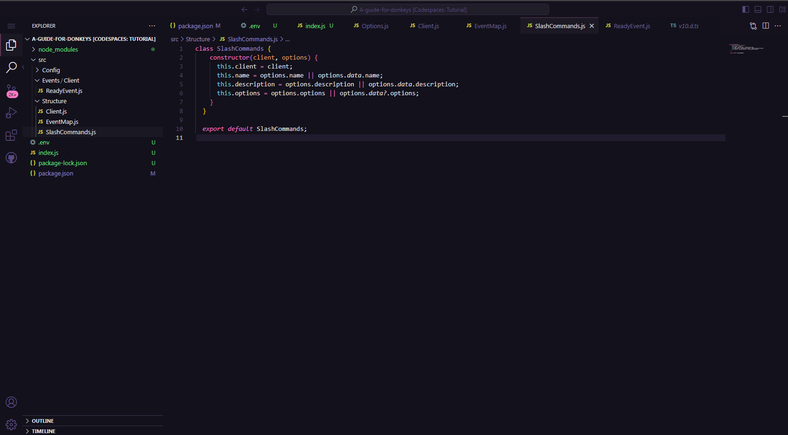

### PrefixCommands

Alright, we've added SlashCommands, but why not `PrefixCommands`? It's a valid question, and in this section, we'll explain how to add PrefixCommands to the structure. Remember that these are entirely optional, just like SlashCommands.

First, let's return to our `Client.js` file, where we will add the `PrefixCommands` by including the following content:

```js
async getPrefixCommands(path = 'src/PrefixCommands') {
    const categories = readdirSync(path);
    for (const category of categories) {
      const commands = readdirSync(`${path}/${category}`);

      for (const command of commands) {
        const commandFile = join(process.cwd(), `${path}/${category}/${command}`);
        const { default: PrefixCommands } = await import('file://' + commandFile);
        const cmd = new PrefixCommands(this);
        
        this.PrefixCommandArray.push(cmd);
      }
    }
}
```
Next, we will call this method in the constructor precisely to register our `PrefixCommands:`

```js
export default class extends Client {
    constructor(options) {
        super(options);

        this.SlashCommandArray = [];
        this.PrefixCommandArray = [];
        this.getPrefixCommands();
        this.getSlashCommands();
        this.getEvents();
    }
```
And if you're as sharp as I am, everything will look like this:

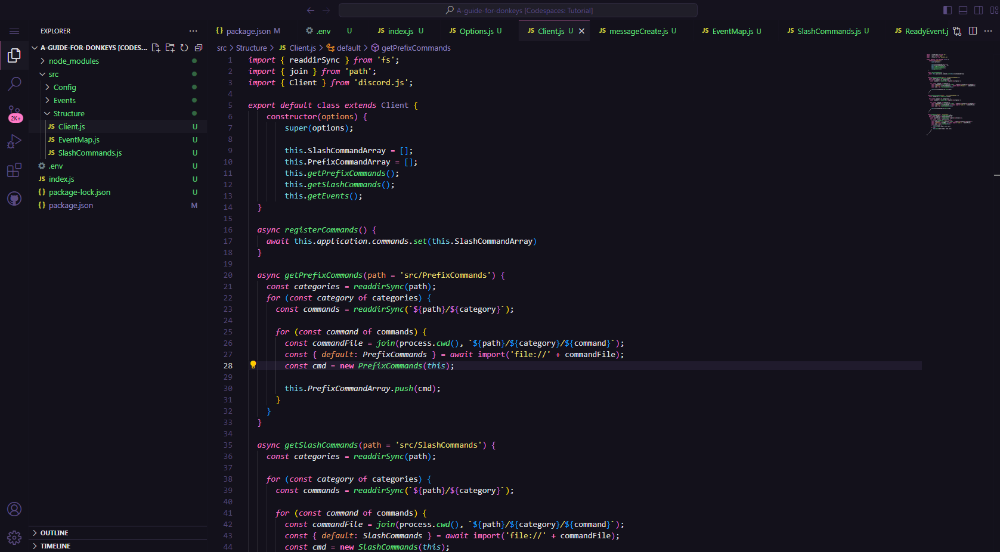

But hold on, we're not quite done yet. We still need to add the class that defines our PrefixCommands. To do this, navigate to the `Structure` folder and create a file named `PrefixCommands.js` for this purpose. Include the following content in the file:

```js
class PrefixCommands {
  constructor(client, options) {
    this.client = client;
    this.name = options.name;
    this.description = options?.description;
    this.aliases = options?.aliases;
  }
}

export default PrefixCommands;
```

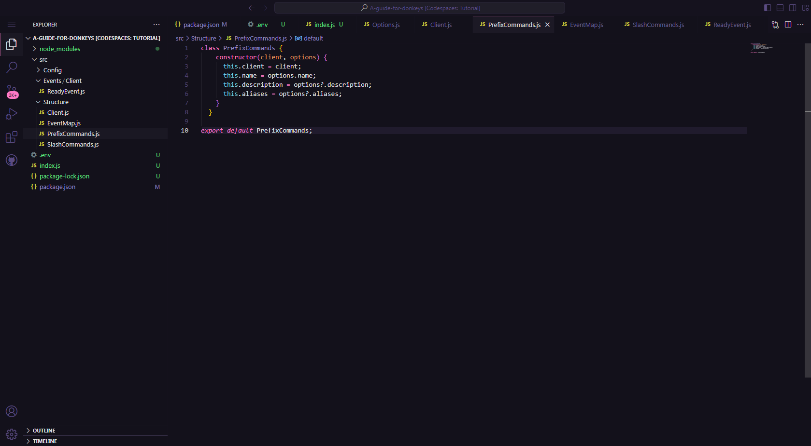

## Events

Events serve as the notifications or signals that something has happened within Discord, such as a user sending a message or a server member joining. In Discord.js, we capture and process these events to create specific responses or functionalities in our bot.

### ready
:::tip
If you didn't add the `registerCommands` method to your `Client.js` file, simply remove the `await this.client.registerCommands();` from the code below.
:::

Now, remember when we configured our `ready` event in the test we conducted? We'll do the same thing, but this time using classes instead of the raw approach. 

We will create an `Events` folder inside the `src` directory. Inside this `Events` folder, we'll create a subfolder named `Client` and create a file named `ReadyEvent.js` with the following content:

```js
import EventMap from '../../Structure/EventMap.js';

export default class extends EventMap {
  constructor(client) {
    super(client, {
      name: 'ready',
      once: true
    });
  }
  run = async () => {
    await this.client.registerCommands(); // We use 'this.client' to reference our extended class from the 'Client.js' file.
    console.log(`Ready! Logged in as ${this.client.user.tag}`); 
  };
};
```
If you, just like me, have done everything correctly, it will look like this:

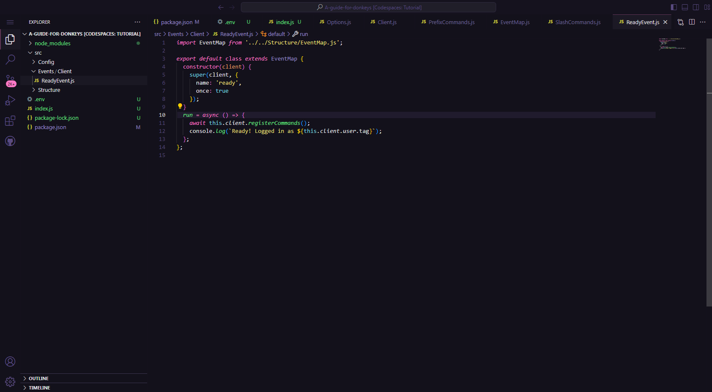

### interactionCreate

:::warning
This section will be applicable only to those who have configured the `SlashCommands`. If you haven't configured them, please refer to the [`SlashCommands`](#slashcommands) section or simply proceed to the next step.
:::

Okay, just like we created and configured our `ready` event, we'll do the same for our `interactionCreate` event. We'll add a subfolder within the 'Events' directory called '`Interaction` and place our `interactionCreate.js` file inside with the following content:

```js
import EventMap from '../../Structure/EventMap.js';

export default class extends EventMap {
  constructor(client) {
    super(client, {
      name: 'interactionCreate'
    });
  }
  run = async (interaction) => {
    const commandName = interaction.commandName;
    const command = this.client.SlashCommandArray.find((c) => c.name === commandName);

    command.run(interaction);
  }
}
```
Now, everything will look like this:

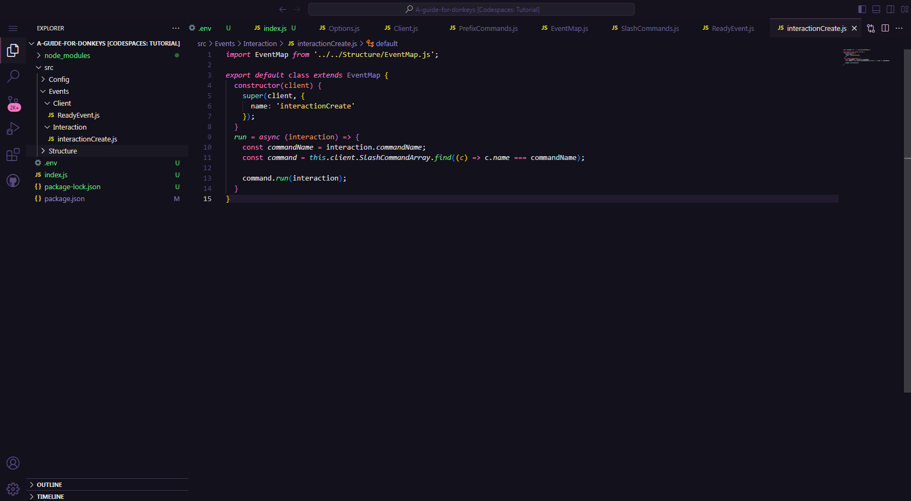

### messageCreate

:::warning
This section will be applicable only to those who have configured the `PrefixCommands`. If you haven't configured them, please refer to the [`PrefixCommands`](#prefixcommands) section or simply proceed to the next step.
:::

Following the section above, we will create a subfolder within the `Events` folder named `Message` and include a file called `messageCreate.js` with the following content:

```js
import EventMap from '../../Structure/EventMap.js';

export default class extends EventMap {
    constructor(client) {
        super(client, {
            name: 'messageCreate'
        });
    }
    run = async (message) => {
        if (message.author.bot) return;

        const prefix = '--'; // change the prefix here
        if (!message.content.toLowerCase().startsWith(prefix)) return;

        const content = message.content.slice(prefix.length).trim();
        const [cmd, ...args] = content.split(" ");
        const command = this.client.PrefixCommandArray.find((c) => c.name === cmd.toLowerCase() || c.aliases?.includes(cmd.toLowerCase()))

        if (!command) return;

        command.run(message, args);
    }
}
```
I think you're already tired of hearing this, but everything will look like this:

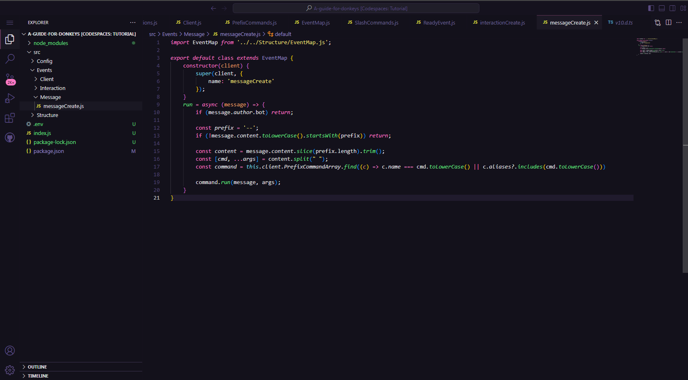

## Creating SlashCommands

Perhaps this is the most crucial module so far. We'll create our first slash command to check if everything is in order. First, let's create a folder named `SlashCommands` inside the `src` directory. Within the `SlashCommands` folder, we'll establish a subfolder named `Test` with a file named `TestCommand.js` with the following content:
